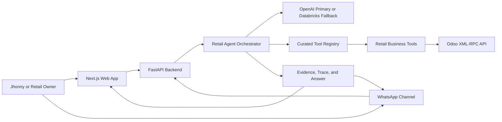
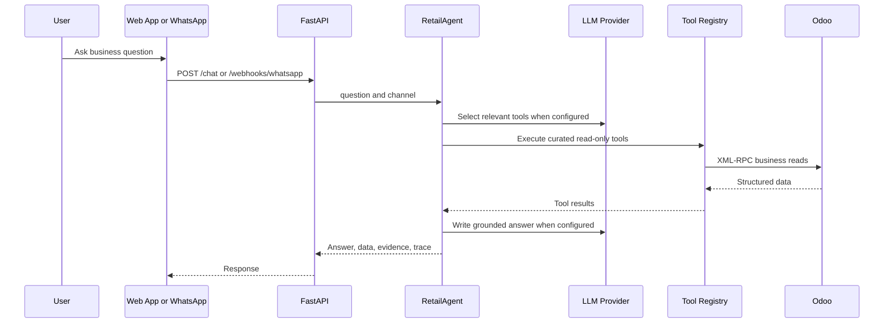

# Jhonny Retail Agent POC Plan

**Status:** Review-ready local POC plan
**Audience:** Tiago, Rodrigo, founding team, and pilot reviewers
**Scope:** Retail intelligence web app, curated Odoo agent, WhatsApp channel, deployment path, and first paid-pilot readiness
**Prepared:** May 10, 2026

---

## Executive Summary

The Jhonny Retail Agent POC turns live Odoo data into a practical decision tool for a small retail owner. The product now has a local FastAPI backend, a Next.js web app, a richer analytics dashboard, an assisted chat surface, and a WhatsApp webhook scaffold that uses the same backend agent path.

The strongest product loop is simple: Jhonny opens the app, sees current sales, stock, purchases, and financial exposure, then asks the assistant what needs attention. The assistant answers from curated Odoo tools rather than free-form database access. This keeps the demo grounded, repeatable, and safer for a paid pilot.

The build remains local-first while the demo flow is stabilized. Cloud deployment should start only after review confirms the demo is strong enough and the team has a confirmed hosting account or subscription. A Render blueprint and Dockerfiles already exist as a reference path, while Azure Container Apps remains the preferred enterprise-aligned option once access is available.

## Table of Contents

1. Product Goal
2. Current Implementation
3. Target Architecture
4. App Experience
5. Agent And Tooling
6. WhatsApp Channel
7. Deployment And Security
8. Workstream Ownership
9. Roadmap And Milestones
10. Commercial Pilot Plan
11. Risks And Controls
12. Review Checklist And Next Actions

## 1. Product Goal

Build a first POC that Jhonny can use and that can be shown to similar retailers as a paid-pilot offer. The product should not become a broad AI platform before the first commercial proof points. It should focus on daily owner decisions from systems the retailer already uses.

| Capability | Current Description | Review Success Criteria |
|---|---|---|
| Live analytics app | Next.js app with home, analytics, and assisted agent surfaces | Reviewer can understand store performance without reading Odoo directly |
| Curated business agent | FastAPI `/chat` endpoint uses OpenAI first, Databricks fallback, or deterministic routing | Answers are grounded in tool output and include evidence metadata |
| Odoo intelligence tools | Read-only tools cover sales, stock, purchases, bills, receivables, margin, risk, and daily priorities | Tool catalogue matches the first buyer questions |
| WhatsApp channel | Webhook accepts Twilio form payloads and Meta WhatsApp JSON payloads | Approved sender can receive concise grounded answers |
| Repeatable pilot | Local-first workflow plus container deployment path | Next retailer can be onboarded without rewriting the product |

## 2. Current Implementation

The current build is a working local POC:

| Component | Current State |
|---|---|
| Backend API | FastAPI app at `http://127.0.0.1:8000` |
| Web app | Next.js app at `http://127.0.0.1:3000` |
| Odoo integration | XML-RPC client with authentication, live reads, and retry handling for transient transport failures |
| Agent | `RetailAgent` orchestrates curated tools, LLM selection, answer writing, evidence summaries, and fallback routing |
| Frontend shell | EY/EW-style branded app shell with theme support, profile menu, branded header, and client footer |
| Demo access | `APP_AUTH_TOKEN` protects app endpoints; frontend stores the demo token in local storage |
| Deployment assets | Root backend Dockerfile, `frontend/Dockerfile`, and `render.yaml` blueprint |

Local development URLs:

| Service | URL |
|---|---|
| Web app | `http://127.0.0.1:3000` |
| Backend API | `http://127.0.0.1:8000` |
| Health check | `http://127.0.0.1:8000/health` |

## 3. Target Architecture



The app and WhatsApp channel share the same backend, agent, and tool registry. This matters because the team can improve one agent path and immediately benefit both channels.

The target product should preserve three constraints:

| Constraint | Reason |
|---|---|
| Read-only operational access first | Reduces risk during pilot and avoids changing client records |
| Curated tools only | Prevents unsupported LLM claims and keeps answers explainable |
| Local-first until reviewed | Avoids cloud work before the demo and commercial story are validated |

## 4. App Experience

The app has three main surfaces: Home, Analytics, and Assisted Agent.

| Surface | Current Content | Purpose |
|---|---|---|
| Home | Branded hero, store pulse, daily sales, daily profit, last week sales estimate, profit margin, YTD profit, YTD sales, stock value, supplier bill exposure | Show the value in the first 30 seconds |
| Analytics | Sales, Stock, Purchases, and Financials dashboards with period selector | Let reviewers inspect the operational data story |
| Assisted Agent | Chat interface, suggested prompts, session history, answer metadata, evidence trace, request ID | Let the owner ask business questions in plain language |

Current analytics dashboard coverage:

| Dashboard | Included Views |
|---|---|
| Sales | Period sales, average daily sales, top product, margin, daily trend, weekday revenue, hourly sales, category ranking, brand ranking |
| Stock | Stock value, stock units, low-stock items, top stock brand, stock by brand, stock by category, stock antiquity, low-stock watchlist |
| Purchases | Period purchases, bills to pay, purchase ratio, supplier bill exposure, recent purchase orders, selectable open bill preview with line details |
| Financials | Receivables, payables, working capital, profitability view, cash exposure, period purchases versus sales |

The app should continue to be optimized for a shop-owner demo rather than an internal BI analyst workflow. The interface should stay simple, visual, and action-oriented.

## 5. Agent And Tooling

The agent is grounded in a registry of read-only Odoo tools. With `OPENAI_API_KEY` configured, the agent uses OpenAI for tool planning and answer writing. If OpenAI is not configured, it attempts Databricks Model Serving if those environment variables are present. If no LLM provider is configured, deterministic routing keeps the local demo usable.



Current tool groups:

| Group | Tools |
|---|---|
| Sales | `get_today_sales`, `get_daily_sales_series`, `get_month_sales`, `get_sales_by_category`, `get_sales_performance_breakdown`, `get_top_and_bottom_products`, `get_recent_orders` |
| Stock | `get_stock_value`, `get_stock_value_by_category`, `get_low_stock`, `get_stock_cover_and_velocity`, `get_dead_and_aged_stock` |
| Purchases | `get_purchase_summary`, `get_purchase_vs_sales_analysis`, `get_supplier_purchase_history`, `get_product_replenishment_insight` |
| Finance | `get_key_financials`, `get_open_bills`, `get_open_customer_invoices`, `get_profitability_snapshot`, `get_margin_by_product_category_brand`, `get_price_cost_exceptions`, `get_working_capital_snapshot`, `get_financial_risk_alerts` |
| Briefing | `get_business_snapshot`, `get_daily_owner_briefing`, `get_recommendation_for_question` |

The answer payload can include:

| Field | Purpose |
|---|---|
| `answer` | User-facing response |
| `tool` | Tool or tools used |
| `data` | Structured result for app inspection |
| `evidence` | Summary of supporting data |
| `tool_trace` | Tools, arguments, latency, and result summaries |
| `visualization` | Chart payload when a visual answer is appropriate |
| `llm_provider` | `openai`, `databricks`, `fallback`, or `not_configured` |
| `request_id` | Traceability for logs and review |

## 6. WhatsApp Channel

The WhatsApp route is implemented as:

```text
POST /webhooks/whatsapp
```

It accepts:

| Provider Path | Payload | Response |
|---|---|---|
| Twilio WhatsApp sandbox or production | Form-encoded `From` and `Body` | TwiML XML response |
| Meta WhatsApp Cloud API | JSON webhook payload | JSON response with `answer` and `tool` |

Production safeguards already represented in the backend:

| Control | Current Behavior |
|---|---|
| Sender allowlist | `WHATSAPP_ALLOWED_NUMBERS` restricts approved phone numbers when set |
| Rate limiting | `WHATSAPP_RATE_LIMIT_PER_MINUTE` limits messages by sender |
| Twilio signature | `TWILIO_AUTH_TOKEN` validates `x-twilio-signature` against `PUBLIC_WHATSAPP_WEBHOOK_URL` |
| Meta signature | `WHATSAPP_APP_SECRET` validates `X-Hub-Signature-256` |
| Short channel answers | Agent keeps WhatsApp answers shorter than app answers |
| Sensitive data control | Agent prompt avoids customer personal data |

WhatsApp should remain a secondary channel until the app demo is strong. It is valuable because it makes the owner experience immediate, but it should not drive scope creep before the core analytics and agent story are approved.

## 7. Deployment And Security

The current recommendation is still local-first until the review confirms demo readiness. When hosted access is available, deploy two services:

| Service | Artifact | Notes |
|---|---|---|
| Backend API | Root `Dockerfile` | FastAPI, Odoo credentials, LLM credentials, WhatsApp secrets |
| Web app | `frontend/Dockerfile` | Next.js app with `NEXT_PUBLIC_API_BASE_URL` |

Hosting options:

| Option | Recommendation |
|---|---|
| Azure Container Apps | Preferred first enterprise path once Azure access exists |
| Render | Existing `render.yaml` blueprint is available for quick two-service deployment |
| AWS App Runner or ECS Fargate | Valid if AWS access arrives before Azure |

Managed secrets needed for a hosted demo:

| Area | Variables |
|---|---|
| Odoo | `ODOO_URL`, `ODOO_DB`, `ODOO_USERNAME`, `ODOO_API_KEY` |
| App auth and CORS | `APP_AUTH_TOKEN`, `APP_CORS_ORIGINS`, `NEXT_PUBLIC_API_BASE_URL` |
| WhatsApp | `WHATSAPP_ALLOWED_NUMBERS`, `WHATSAPP_RATE_LIMIT_PER_MINUTE`, `PUBLIC_WHATSAPP_WEBHOOK_URL`, `TWILIO_AUTH_TOKEN`, `WHATSAPP_APP_SECRET` |
| LLM | `OPENAI_API_KEY`, `OPENAI_MODEL`, optional `DATABRICKS_HOST`, `DATABRICKS_TOKEN`, `DATABRICKS_MODEL_ENDPOINT` |

Security review notes:

- Rotate any Odoo API key used during development before production or paid pilot hosting.
- Keep `.env` local and out of commits.
- Keep app endpoints protected with `APP_AUTH_TOKEN` until a proper login model is needed.
- Do not expose customer personal data in WhatsApp responses.
- Treat estimated profitability and margins as decision support, not statutory accounting output.

## 8. Workstream Ownership

| Owner | Primary Focus | Current Deliverables |
|---|---|---|
| Tiago | Web app and analytics experience | Home, Analytics, Assisted Agent, frontend polish, mobile-friendly demo flow |
| Rodrigo | WhatsApp feature | Provider decision, webhook setup, phone allowlist, message testing, signature configuration |
| Shared | Backend, Odoo tools, LLM, deployment, validation | FastAPI API, tool registry, OpenAI/Databricks routing, Docker path, smoke tests |
| Founding team | Commercial pilot readiness | Demo script, pricing, outreach, pilot qualification, client feedback loop |

## 9. Roadmap And Milestones

| Phase | Timing | Goal | Owner | Exit Criteria |
|---|---:|---|---|---|
| 1 | Now | Review-ready local app and plan | Shared | App opens locally, dashboard loads, chat answers from Odoo tools |
| 2 | Next | Demo polish and validation | Tiago | 5-minute demo works without engineering explanation |
| 3 | Next | WhatsApp provider test | Rodrigo | Approved number receives correct answer through webhook |
| 4 | Next | Hosted review environment | Shared | Managed secrets, HTTPS, CORS, auth token, health checks, logs |
| 5 | After Jhonny feedback | Paid pilot outreach | Founding team | 10 to 20 qualified retailers contacted with clear pilot offer |
| 6 | After 3 to 5 pilots | Productization decision | Founding team | Repeatable pain, pricing, onboarding effort, and usage evidence are proven |

The next milestone should be a stable owner demo where the reviewer can see live data, ask a question, inspect the evidence, and understand the paid-pilot offer.

## 10. Commercial Pilot Plan

The first paid offer should stay narrow and outcome-focused.

| Item | Recommendation |
|---|---|
| Setup fee | EUR 1,500 to EUR 3,000 |
| Monthly pilot fee | EUR 300 to EUR 900 |
| Anchor offer | EUR 2,000 setup plus EUR 500 per month |
| Pilot duration | 2 to 4 weeks |
| Target clients | Small retailers with 1 to 10 stores |
| First verticals | Surf, outdoor, fashion, footwear, sports equipment, lifestyle retail |

Do not sell the product as generic AI. Sell it as fast daily business answers from systems the retailer already uses.

Pilot scope:

| Included | Excluded For First Pilot |
|---|---|
| One operational system connection, starting with Odoo | Forecasting engine |
| Core dashboards for sales, stock, purchases, and financial exposure | Custom ERP workflows |
| Assisted questions in the web app | Deep accounting reconciliation |
| WhatsApp owner questions when provider access is available | Full multi-tenant SaaS admin |
| Weekly review call and end-of-pilot recommendation | Custom data science project |

## 11. Risks And Controls

| Risk | Impact | Control |
|---|---|---|
| Metrics do not match Odoo UI | Loss of trust | Validate core numbers with Jhonny before external demos |
| Estimated margin is mistaken for accounting profit | Bad decisions | Label margin as estimated from standard cost and include caveats |
| WhatsApp exposes sensitive data | Security risk | Restrict numbers, verify signatures, avoid customer personal data |
| LLM invents unsupported claims | Trust risk | Force answers through curated tools and evidence summaries |
| Development credentials leak | Security risk | Keep `.env` ignored, rotate Odoo key before hosted demo |
| App becomes too broad before selling | Slow revenue | Keep pilot scope around sales, stock, purchases, margin, and daily priorities |
| Cloud work starts too early | Delivery risk | Host only after demo review and access are confirmed |
| Odoo field quality varies by client | Onboarding risk | Document required models and add validation checks per new retailer |

## 12. Review Checklist And Next Actions

Review checklist:

| Check | Expected Result |
|---|---|
| Backend health | `GET /health` returns `{"status":"ok"}` |
| Dashboard | `GET /dashboard` returns live Odoo metrics when `X-App-Token` is valid |
| Agent chat | `POST /chat` returns answer, tool, evidence, trace, provider, and request ID |
| OpenAI path | `scripts/smoke_openai_chat.py` confirms `llm_provider` is `openai` when credentials are set |
| Security checks | `scripts/evaluate_api_security.py` passes sender allowlist, rate limit, and signature tests |
| Agent routing | `scripts/evaluate_agent.py` passes deterministic routing checks |
| Frontend build | `npm run build` passes in `frontend/` before hosted deployment |

Immediate next actions:

| Priority | Action | Owner |
|---:|---|---|
| 1 | Run the app locally and rehearse the 5-minute review demo | Tiago |
| 2 | Validate sales, stock, purchase, and bill numbers against Odoo UI | Shared |
| 3 | Run OpenAI smoke test before any external review | Shared |
| 4 | Decide whether the review needs WhatsApp live or app-only demo | Rodrigo and founding team |
| 5 | If WhatsApp is included, configure provider, public URL, allowlist, and signature secret | Rodrigo |
| 6 | Prepare hosted environment only after local demo approval | Shared |
| 7 | Use Jhonny feedback to qualify 10 to 20 similar retailers for paid pilots | Founding team |

The POC is now strong enough to review as a focused retail intelligence demo. The team should use the review to decide whether to polish for Jhonny first, connect WhatsApp live, or move directly into a hosted pilot environment.
