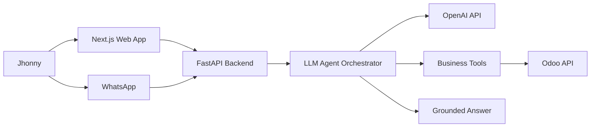

# Jhonny Retail Agent POC Plan

**Status:** Local-first implementation in progress
**Audience:** Tiago, Rodrigo, and founding team
**Scope:** Web app, analytics, LLM agent, WhatsApp channel, and first paid-pilot readiness
**Prepared:** May 2026

---

## Executive Summary

The goal is to turn the current Jhonny Odoo integration into a simple, sellable retail intelligence product. The first POC should prove one strong loop: Jhonny can see live business analytics in a web app and ask business questions through an agent, while Rodrigo connects the same agent to WhatsApp.

This should remain narrow. The product is not a generic AI platform yet. It is a practical business copilot for small retailers that answers daily owner questions from live operational data: sales, stock value, low stock, category performance, purchases, and basic financial signals.

The current build is running locally first: FastAPI on `http://127.0.0.1:8000` and Next.js on `http://127.0.0.1:3000`. Cloud hosting is deferred until the app is demo-ready and Azure or AWS access is confirmed.

## Table of Contents

1. Product Goal
2. Workstream Ownership
3. Target Architecture
4. Tiago Plan: App And Analytics
5. Rodrigo Plan: WhatsApp Channel
6. Shared Backend And Agent Plan
7. Roadmap And Milestones
8. Commercial Pilot Plan
9. Risks And Controls
10. Immediate Next Actions

## 1. Product Goal

Build a first POC that Jhonny can actually use and that can be shown to other small retailers.

The first version should include:

| Capability | Description | Success Criteria |
|---|---|---|
| Analytics app | Web app with live Odoo dashboards | Jhonny can see sales, stock, categories, and low stock |
| Agent chat | App chat box for natural-language questions | Owner asks a question and receives a grounded answer from Odoo data |
| WhatsApp agent | WhatsApp interface for the same agent | Approved phone number receives correct answers |
| Repeatable pilot | Simple setup path for the next retailer | New client can be onboarded without rewriting the product |

## 2. Workstream Ownership

| Owner | Primary Focus | Key Deliverables |
|---|---|---|
| Tiago | Web app and analytics experience | Analytics tab, agent chat page, app polish, mobile-friendly demo |
| Rodrigo | WhatsApp feature | WhatsApp provider setup, webhook connection, phone authorization, message formatting |
| Shared | Backend, tools, LLM agent, deployment | FastAPI backend, Odoo tools, Databricks LLM calls, deployment, logs |

## 3. Target Architecture

The app and WhatsApp should share the same backend and the same agent logic. This avoids building two separate products.

Local development URLs:

| Component | URL |
|---|---|
| Web app | `http://127.0.0.1:3000` |
| Backend API | `http://127.0.0.1:8000` |
| Health check | `http://127.0.0.1:8000/health` |

## 4. Tiago Plan: App And Analytics

Tiago should focus on making the app simple and usable. The first app should have two modes:

| Mode | Purpose | Content |
|---|---|---|
| Analytics | Business overview | Today sales, month sales, YTD sales, stock value, category mix, low stock |
| Agent Chat | Ask the business questions | Chat box, suggested prompts, answer history, tool used |

Minimum app requirements:

- Demo token access.
- Analytics tab with live Odoo numbers.
- Agent chat tab with prompt buttons.
- Clear loading and error states.
- Mobile-friendly layout for a shop owner.
- No complex admin area yet.

Suggested first prompts:

- How much did we sell today?
- What is our stock value?
- What categories sold today?
- What is low stock?
- Give me key financials.

## 5. Rodrigo Plan: WhatsApp Channel

Rodrigo should connect WhatsApp after the backend chat endpoint is stable.

Recommended path:

| Step | Decision | Notes |
|---|---|---|
| 1 | Start with Twilio sandbox or Meta WhatsApp Cloud API | Twilio is faster for demo; Meta is better for production |
| 2 | Point inbound messages to `/webhooks/whatsapp` | Backend already exposes this route |
| 3 | Restrict approved numbers | Only Jhonny and internal test phones should be allowed |
| 4 | Test core prompts | Use the same questions as the app |
| 5 | Add production controls | Signature verification, logging, rate limits |

WhatsApp answers should be shorter than app answers and should avoid sensitive customer data.

## 6. Shared Backend And Agent Plan

The backend should be the product core. It should expose:

| Endpoint | Purpose |
|---|---|
| `GET /health` | Hosting and uptime checks |
| `GET /dashboard` | App analytics data |
| `POST /chat` | App agent chat |
| `POST /tools/{tool_name}` | Internal testing for business tools |
| `POST /webhooks/whatsapp` | WhatsApp inbound messages |

The LLM agent should not query raw Odoo freely. It should choose from curated tools:

| Tool | Purpose |
|---|---|
| `get_today_sales` | Current day sales and order count |
| `get_month_sales` | Month-to-date sales |
| `get_sales_by_category` | Sales grouped by category |
| `get_stock_value` | Inventory value and units |
| `get_stock_value_by_category` | Stock value concentration |
| `get_low_stock` | Products needing review |
| `get_key_financials` | YTD sales, stock, purchases, receivables, payables |

## 7. Roadmap And Milestones

| Phase | Timeline | Goal | Owner |
|---|---:|---|---|
| Phase 1 | Now | Local app with analytics and agent chat | Tiago |
| Phase 2 | Next | WhatsApp connected to same agent | Rodrigo |
| Phase 3 | Next | OpenAI LLM credentials configured and tested | Shared |
| Phase 4 | Later | Hosted demo with secure secrets and basic logs | Shared |
| Phase 5 | After Jhonny demo | Paid pilot outreach to similar retailers | Founding team |

The most important milestone is a stable demo where the owner asks a question and the answer comes from live Odoo data.

## 8. Commercial Pilot Plan

The first paid offer should be simple:

| Item | Recommendation |
|---|---|
| Setup fee | EUR 1,500 to EUR 3,000 |
| Monthly pilot fee | EUR 300 to EUR 900 |
| Anchor offer | EUR 2,000 setup plus EUR 500 per month |
| Pilot duration | 2 to 4 weeks |
| Target clients | Small retailers with 1 to 10 stores |

Do not sell it as "AI". Sell it as fast daily business answers from systems the retailer already uses.

## 9. Risks And Controls

| Risk | Impact | Control |
|---|---|---|
| Numbers do not match Odoo UI | Loss of trust | Validate key metrics manually with Jhonny |
| WhatsApp exposes sensitive data | Security risk | Restrict phone numbers and avoid customer personal data |
| Team builds too much before selling | Slow revenue | Keep the first version narrow |
| LLM gives unsupported answers | Trust risk | Force answers through curated tools |
| Credentials are exposed | Security risk | Rotate Odoo key and use managed secrets before deployment |
| Cloud work starts too early | Delivery risk | Keep development local until demo readiness and cloud access are confirmed |

## 10. Immediate Next Actions

| Priority | Action | Owner |
|---:|---|---|
| 1 | Polish the two-tab app for Jhonny: Analytics and Agent Chat | Tiago |
| 2 | Keep validating local dashboard and chat with live Odoo data | Shared |
| 3 | Configure OpenAI API credentials and smoke-test `/chat` | Shared |
| 4 | Connect WhatsApp provider to `/webhooks/whatsapp` | Rodrigo |
| 5 | Decide Azure or AWS only after access is available | Shared |
| 6 | Run a 5-minute Jhonny demo and collect feedback | Founding team |
| 7 | Use feedback to approach 10 to 20 similar retailers | Founding team |

The current priority is to make the app feel real and useful for Jhonny. Once the app and WhatsApp both work from live data, the team should start selling paid pilots immediately rather than waiting for a full SaaS platform.
